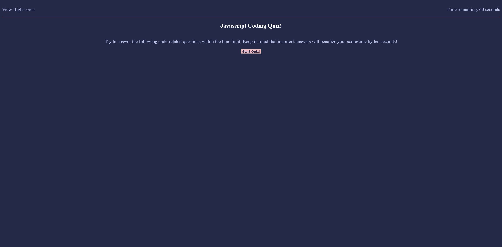

# ILCodingQuiz

Coding Quiz. Bootcamp Homework Week 4

This application is a short quiz for JavaScript, made in JavaScript.
To begin, click the Start button. A countdown timer for 60 seconds will begin and the first question of the quiz will be shown. Click the buttons to answer the questions and move to the next question. If your answer was correct, the message "Correct!" will appear below the answers for 1 second. If your answer was wrong, the message "Wrong!" will be displayed below the answers for 1 second and 10 seconds will be removed from the countdown clock. The quiz ends when the timer hits 0 or when all questions are answered, whichever comes first. When all answers are submitted, the timer will stop and the remaining time will be displayed, along with the number of correct answers you clicked. Here you can submit your initials for the high score board, which is kept in Local storage.

Clicking the "View Highscores" text in the upper left will display the top 10 scores saved to your local storage. If there are less than 10 scores in local storage, the list will display "No Scores".
At any time you can return to the start page by clicking the "Return Home" button in the bottom left of the screen.

You can find this application hosted at https://love-ivy.github.io/ILCodingQuiz/

March 3rd, 2022
Created repository

May 6th, 2022
Updated fully functioning quiz.
